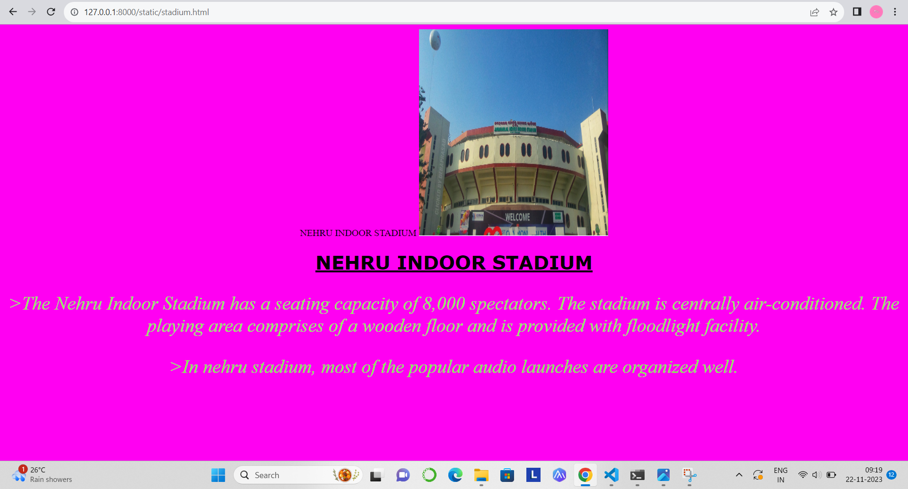
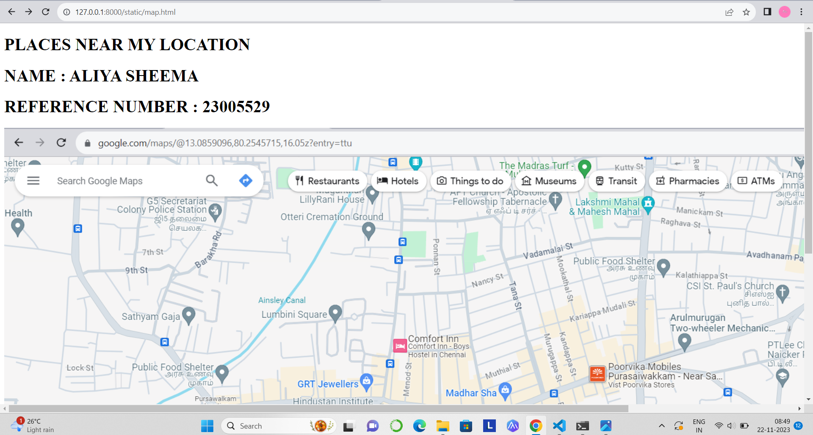
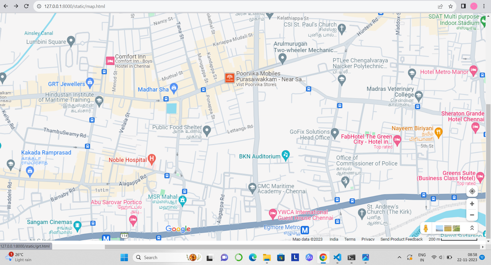
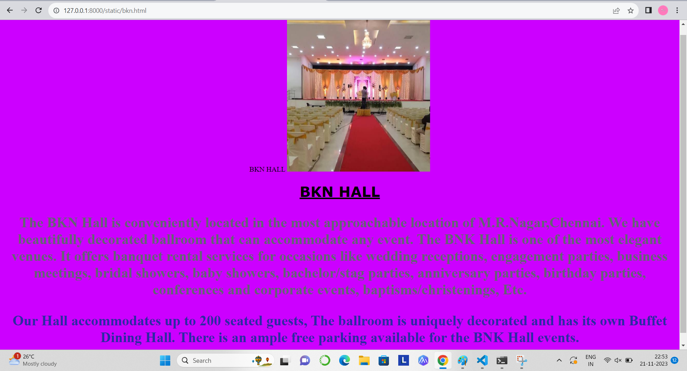
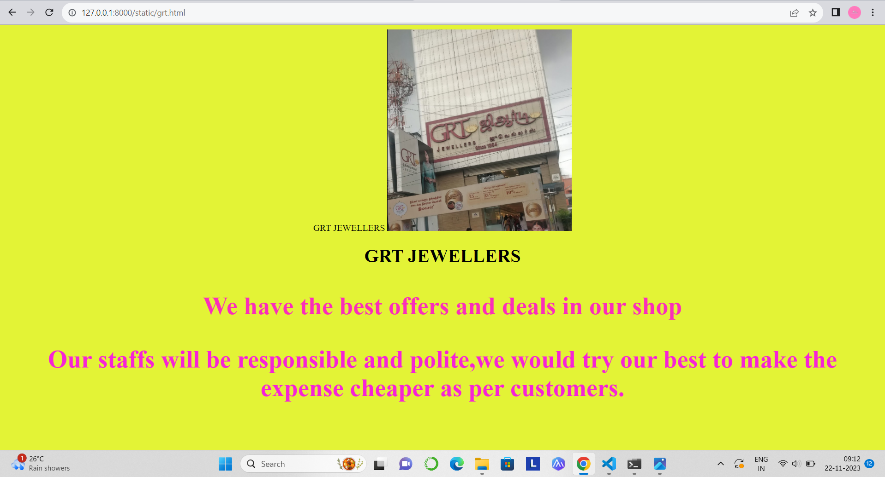
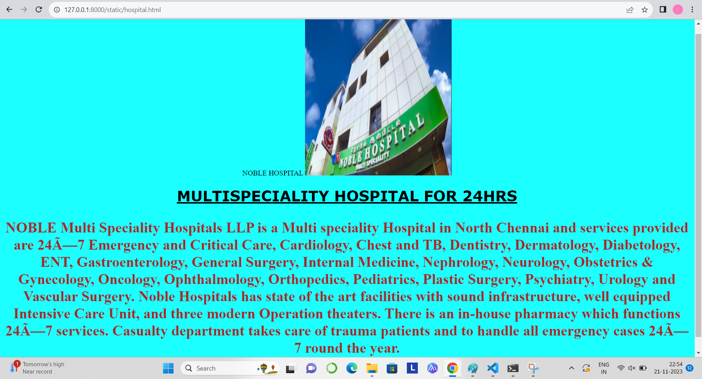
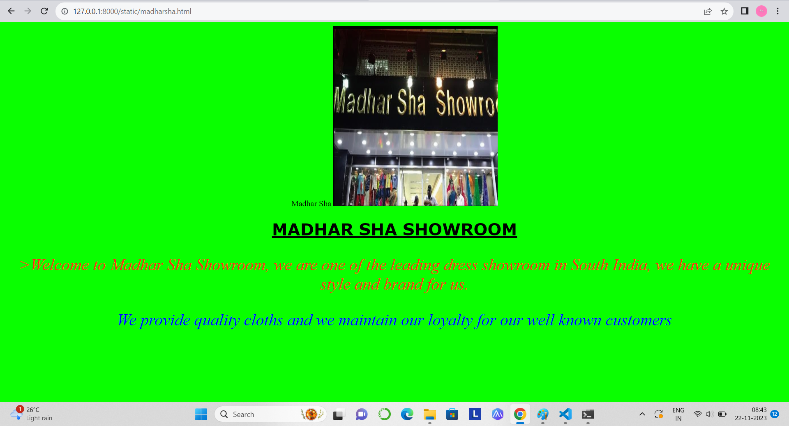

# PLACES AROUND ME
NAME : ALIYA SHEEMA

REFERENCE NUMBER : 23005529

DEPARTMENT : AIDS
# AIM :
To develop a website to display details about the places around my house.

# DESIGN STEPS:
## Step 1:
Clone the git repository.
## Step 2:
Create new folder image_maps.
## Step 3:
Write the html code.
## Step 4:
Run the code.

# CODE :
### map.html code :
```<!DOCTYPE html>
<html>
    <head>
        <title>maps</title>
    </head>
    <body>
    <H1>PLACES NEAR MY LOCATION</H1>
    <h1>NAME:ALIYA SHEEMA</h1>
    <H1>REF NO:23005529</H1>
    
    <map name="navigation">
        <area shape="rect" coords="792,445,1070,601" alt="ooo" href="madharsha.html" title="MADHAR SHA">
        <area shape="rect" coords="1114,672,1354,787" alt="ok" href="bkn.html" title="BKN HALL">
        <area shape="rect" coords="526,435,722,510" alt="oi" href="grt.html" title="GRT JEWELLERS">
        <area shape="rect" coords="714,682,922,765"  alt="lol" href="hospital.html" title="NOBLE HOSPITALS">
        <area shape="rect" coords="1722,254,1916,328" alt="oo" href="stadium.html" title="NEHRU INDOOR STADIUM">
    </map>
    </body>
</html>
```
### bkn.html code:
```<!DOCTYPE html>
<html>
    <head>BKN HALL</head>
    <body style="background-color:rgb(204, 0, 255)"; align ="center">

        
        <h1 style="font-family : verdana" ><u>BKN HALL</u></h1>
        <p style="color:rgb(99, 99, 115); font-size: 200%"><strong>The BKN Hall is conveniently located in the most approachable location of M.R.Nagar,Chennai. We have beautifully decorated ballroom that can accommodate any event. The BNK Hall is one of the most elegant venues. It offers banquet rental services for occasions like wedding receptions, engagement parties, business meetings, bridal showers, baby showers, bachelor/stag parties, anniversary parties, birthday parties, conferences and corporate events, baptisms/christenings, Etc.</strong></p>
        <p style="color:rgb(42, 42, 165); font-size: 200%";><strong>Our Hall accommodates up to 200 seated guests, The ballroom is uniquely decorated and has its own Buffet Dining Hall. There is an ample free parking available for the BNK Hall events.</strong></p>
    </body>
</html>
```
### grt.html code :
```<!DOCTYPE html>
<html>
    <head>GRT JEWELLERS</head>
    <body style="background-color:rgb(202, 79, 155);" align="center" >
        
        <h1>GRT JEWELLERS</h1>
        <p style="color:rgb(227, 33, 33); font-size: 270%"><strong>We have the best offers and deals in our shop</strong></p>
        <p style="color:rgb(165, 42, 42); font-size: 270%"><strong>Our staffs will be responsible and polite,we would try our best to make the expense cheaper as per customers.</strong></p>
    </body>

</html>
```
### hospital.html code :
```<!DOCTYPE html>
<html>
    <head>NOBLE HOSPITAL</head>
    <body style="background-color:rgb(28, 255, 255);"align ="center">
        
        <h1 style="font-family:verdana;"> <u>MULTISPECIALITY HOSPITAL FOR 24HRS</u></h1>
        <p style="color:rgb(165, 42, 42); font-size: 200%;" ><strong>NOBLE Multi Speciality Hospitals LLP is a Multi speciality Hospital in North Chennai and services provided are 24×7 Emergency and Critical Care, Cardiology, Chest and TB, Dentistry, Dermatology, Diabetology, ENT, Gastroenterology, General Surgery, Internal Medicine, Nephrology, Neurology, Obstetrics & Gynecology, Oncology, Ophthalmology, Orthopedics, Pediatrics, Plastic Surgery, Psychiatry, Urology and Vascular Surgery. Noble Hospitals has state of the art facilities with sound infrastructure, well equipped Intensive Care Unit, and three modern Operation theaters. There is an in-house pharmacy which functions 24×7 services. Casualty department takes care of trauma patients and to handle all emergency cases 24×7 round the year. </strong></p>
    </body>
</html>
```
### madharsha.html code :
```<!DOCTYPE html>
<html>
    <head>Madhar Sha</head>
    <body style="background-color:rgb(255, 0, 166);" align ="center">
        
        <h1 style="font-family:verdana"><u>MADHAR SHA SHOWROOM</u></h1>

        <p style="color:rgb(99, 99, 115); font-size: 200%"> <i>>Welcome to Madhar Sha Showroom, we are one of the leading dress showroom in South India, we have a unique style and brand for us.</i></p>
        <p style="color:blue; font-size: 200%"><i>We provide quality cloths and we maintain our loyalty for our well known customers</i></p>
        
    </body>
</html>
```
### stadium.html code :
```<!DOCTYPE html>
<html>
    <head>NEHRU INDOOR STADIUM</head>
    <body style="background-color:rgb(255, 0, 166);" align ="center">
        
        <h1 style="font-family:verdana"><u>NEHRU INDOOR STADIUM</u></h1>

        <p style="color:rgb(99, 99, 115); font-size: 200%"> <i>>In nehru stadium, most of the popular audio launches are organized well.</i></p>        
    </body>
</html>
```

# OUTPUT :

### map.html :




### bkn.html :



### grt.html :



### hospital.html :



### madharsha.html :



### stadium.html :


# RESULT :

Thus the expected image map output has been executed successfully.

